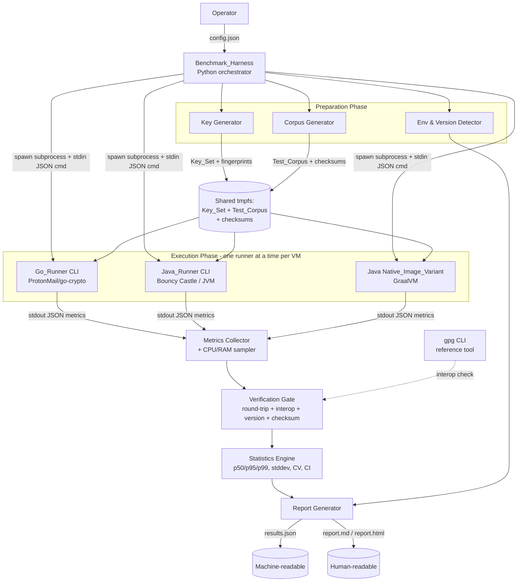
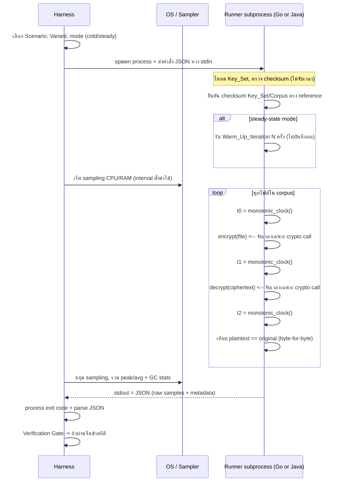

# Design Document

## Overview
ภาพรวม

เอกสารออกแบบนี้อธิบายสถาปัตยกรรมและรายละเอียดทางเทคนิคของ Proof of Concept (POC) สำหรับ **เปรียบเทียบประสิทธิภาพการ encrypt/decrypt แบบ PGP ระหว่างภาษา Go และ Java (Spring Boot)** ตามที่กำหนดไว้ใน `requirements.md` (32 requirements)

**ขอบเขตการวัด (Scope):** POC นี้วัดเฉพาะการ **encrypt และ decrypt** แบบ PGP เท่านั้น การลงลายเซ็นดิจิทัล (signing) และการตรวจสอบลายเซ็น (signature verification) **อยู่นอกขอบเขตและไม่ถูกวัด** (Req 1.6) ทุกองค์ประกอบในการออกแบบ (CryptoEngine ของทั้งสองภาษา, Verification Gate, การจับเวลา) จึงจำกัดไว้ที่เส้นทาง encrypt/decrypt เท่านั้น โดยไม่มีองค์ประกอบใดทำหรือวัด sign/verify

เป้าหมายหลักสองข้อที่เป็นข้อบังคับเด็ดขาด (hard constraints) จาก Operator และเป็นแกนของการออกแบบทั้งหมด:

1. **ผลต้องวัดประสิทธิภาพจริงและปลอมแปลง/โกงไม่ได้ (real, non-gameable):** ทุกตัวเลขที่เข้าสถิติต้องผ่าน gate ความถูกต้องก่อนเสมอ ระบบบันทึก raw per-operation samples, checksum, เวอร์ชัน และ interoperability เพื่อให้ตรวจสอบย้อนหลัง (auditable) และทำซ้ำได้ (reproducible)
2. **แต่ละภาษาต้องวิ่งที่ประสิทธิภาพสูงสุด (max performance, fair to each language's best):** แต่ละภาษามีหลาย Implementation_Variant แล้วคัด Best_Variant มาแข่ง head-to-head ภายใต้ Key_Set, Test_Corpus, Crypto_Profile และ concurrency level เดียวกันทุกประการ

### หลักการออกแบบที่เป็นแกนกลาง (Core Design Principles)

- **แยก runtime ออกจากกันด้วย subprocess:** Benchmark_Harness เป็น orchestrator ที่เป็นกลาง (neutral) ไม่ทำ crypto เอง แต่สั่งรัน Go_Runner และ Java_Runner เป็น subprocess แยกกัน เพื่อแยก runtime, GC และ memory ของแต่ละภาษาออกจากกันโดยสมบูรณ์ และวัดอย่างยุติธรรม
- **วัดเฉพาะการเรียก crypto จริง (core crypto-time metric):** core crypto-time metric ที่ใช้เปรียบเทียบ steady-state, throughput และ latency มาจาก monotonic clock ที่ครอบเฉพาะการเรียกฟังก์ชัน encrypt/decrypt เท่านั้น ไม่รวมการสร้าง/โหลดกุญแจ, file I/O และ warm-up (Requirement 1.1, 24) ส่วนเวลา Cold_Start (Process_Startup_Time + JIT warm-up) เป็น **metric เสริมที่มีป้ายกำกับแยกต่างหาก ไม่ถูกรวมเข้าใน core crypto-time / steady-state statistics** (Requirement 21.7)
- **Correctness gate ก่อน performance:** ไม่มีตัวเลขเวลาใดถูกนับเข้าสถิติจนกว่าจะผ่าน round-trip byte-for-byte และ (เมื่อเกี่ยวข้อง) interoperability check (Requirement 5, 25)
- **Machine-readable + human-readable:** ผลลัพธ์ออกเป็น JSON (เครื่องอ่าน, auditable) และรายงานสรุปสำหรับมนุษย์ (Requirement 20.5)
- **Single source of configuration:** พารามิเตอร์ทั้งหมดมาจากไฟล์ตั้งค่าเดียว และค่าที่ใช้จริงถูกบันทึกซ้ำลง Result_Report (Requirement 19)

### สรุปทางเลือกหลัก (ดูเหตุผลเต็มในหมวด Decisions & Rationale ท้ายเอกสาร)

| ส่วนประกอบ | ทางเลือกที่ตัดสิน | เวอร์ชันเป้าหมาย (บันทึกจริงตอน build ตาม Req 2) |
|---|---|---|
| Go PGP library | `github.com/ProtonMail/go-crypto/openpgp` (fork ที่ดูแลต่อเนื่อง) | Go 1.25.x (stable ล่าสุด ส.ค. 2025) |
| Java PGP library | Bouncy Castle (`bcpg-jdk18on`, `bcprov-jdk18on`) | JDK 25 LTS + Spring Boot 4.x (stable ล่าสุด) |
| Java native variant | GraalVM Native Image (native-build-tools) | GraalVM for JDK 25 |
| Orchestrator (Harness) | Python 3.12+ (driver ที่เป็นกลาง ไม่ทำ crypto) | Python 3.12+ |
| เครื่องมือมาตรฐานอ้างอิง | GnuPG (`gpg`) CLI สำหรับ interoperability | gpg ที่ติดตั้งในสภาพแวดล้อม |

> หมายเหตุสำคัญเรื่อง Spring Boot: ใช้เป็นเพียง **application/runtime shell** ของ Java_Runner (CLI ผ่าน `CommandLineRunner`/`ApplicationRunner`) เท่านั้น **ไม่ใช้** starter ด้าน web, data หรือเครือข่ายใด ๆ เพื่อให้สอดคล้องกับ out-of-scope rule (Requirement 1.2)

## Architecture
สถาปัตยกรรม

### มุมมององค์ประกอบระดับสูง (Component View)

Benchmark_Harness เป็น orchestrator กลางที่ควบคุมทุกอย่าง และเป็น **process แยกต่างหาก** จาก Runner ทั้งสอง Harness ไม่แตะ crypto เลย จึงไม่สามารถลำเอียงเข้าข้างภาษาใดได้ (เป็นกลไก anti-fake ข้อสำคัญ)



### โมเดล subprocess และการแยก runtime (Subprocess Isolation Model)

แต่ละ Benchmark_Run ของ Runner หนึ่งทำงานใน **process ของตัวเองที่แยกเด็ดขาด** Harness บังคับว่ามี Runner ที่กำลังทำงานได้สูงสุด 1 ตัวต่อ VM ในเวลาเดียวกัน (Requirement 3.3) เพื่อกันการแย่งทรัพยากร



### ลำดับเฟสการทำงาน (Pipeline Phases)

1. **Validate Config:** อ่านและตรวจไฟล์ตั้งค่าเดียว ถ้าผิดให้หยุดก่อนสร้าง Result_Report (Requirement 19.6, 8.3, 16.5, 13.5)
2. **Detect Environment & Versions:** บันทึก vCPU, RAM, OS, CPU arch, storage, turbo/governor และเวอร์ชัน Go/JDK/Spring Boot/PGP lib จริง ตรวจกับค่าที่คาดหวัง (Requirement 2, 3.2, 27.1)
3. **Generate Shared Inputs:** สร้าง Key_Set (RSA-2048, RSA-4096, +ECC) และ Test_Corpus บน tmpfs พร้อมคำนวณ checksum (Requirement 31, 4.5, 27.2)
4. **Build Runners:** build Go_Runner, Java_Runner (JVM jar) และ Native_Image_Variant; บันทึก toolchain เวอร์ชัน; ถ้า native build ล้มเหลวให้ข้ามเฉพาะ variant นั้น (Requirement 22.5)
5. **Alternating Execution:** วนหลาย Round สลับลำดับ Go/Java รันทุก Variant ทุก Scenario ทั้งโหมด Cold_Start และ Steady_State (Requirement 8, 21)
6. **Verification Gate:** round-trip, interoperability, checksum, version check ก่อนเข้าสถิติ (Requirement 5, 25, 4.6, 2.5)
7. **Statistics:** คำนวณ p50/p95/p99, mean/min/max, stddev, CV, confidence interval, effect size, noise floor (Requirement 10, 26, 27)
8. **Report:** สร้าง results.json + รายงานมนุษย์อ่าน ภายใน 60 วินาทีหลังจบ (Requirement 20)

### กลไกกันการโกง/ปลอมผล (Anti-Fake / Integrity Architecture)

ออกแบบให้ "ตัวเลขเร็ว" ไม่มีค่าเลยถ้าไม่ผ่าน gate เหล่านี้ก่อน:

| กลไก | วิธีทำงาน | Requirement |
|---|---|---|
| Round-trip gate | ทุกไฟล์ต้อง decrypt(encrypt(x)) == x แบบ byte-for-byte ก่อนเวลาเข้าสถิติ | 5.1, 5.4 |
| Cross-language interop gate | Go-encrypt ต้อง Java-decrypt ได้ และกลับกัน + ตรวจกับ gpg CLI; fail = mark non-comparable | 25 |
| แยกเวลา crypto ออกจาก I/O (core metric) | monotonic clock ครอบเฉพาะ crypto call; key load/file I/O/warm-up ไม่นับ; Cold_Start (startup+JIT) เป็น metric เสริมแยก ไม่รวมใน core/steady-state | 1.1, 21.7, 24 |
| Output encoding เดียวกันทุก Runner | บังคับ binary OpenPGP หรือ ASCII-armored ให้ตรงกันทุก Runner ภายใน Scenario; บันทึกลง Result_Report เพื่อให้เทียบขนาด ciphertext (Req 18.3, 30.3) และ interop ยุติธรรม | 4.7 |
| Checksum ของ input | บันทึก checksum Key_Set/Corpus; ถ้า Runner ใช้ข้อมูลไม่ตรง = ยุติและไม่นับผล | 4.5, 4.6 |
| Version pinning & validation | บันทึกเวอร์ชันจริง major.minor.patch; ไม่ตรง = ผลไม่ถูกต้อง | 2.3, 2.5 |
| Raw sample retention | เก็บ per-operation samples ทุกค่า ไม่ใช่แค่ aggregate เพื่อ audit/reproduce | 10.1, 20.5 |
| Null test / Noise_Floor | รันภาษาเดียวกันแข่งตัวเอง วัดความผันผวนพื้นฐาน ใช้เป็นฐานเทียบ | 27.4, 27.5 |
| Non-comparable propagation | เงื่อนไขผิดปกติทุกชนิด mark non-comparable และไม่เข้าข้อสรุป | 3.5, 7.7, 20.6 |

### สถาปัตยกรรมความยุติธรรม/ประสิทธิภาพสูงสุด (Max-Performance Fairness Architecture)

แต่ละภาษามีหลาย Implementation_Variant เพื่อหา "ตัวเก่งที่สุด" ของภาษานั้น แล้วจึงนำ Best_Variant มาแข่ง:

| มิติ | Go (ProtonMail/go-crypto) | Java (Bouncy Castle) |
|---|---|---|
| in-memory | โหลดทั้งไฟล์เข้า `[]byte` แล้ว encrypt | โหลดเข้า `byte[]` แล้ว encrypt |
| streaming | `io.Pipe` + buffered reader/writer, peak mem คงที่ | `PGPEncryptedDataGenerator.open()` + buffered stream |
| parallel | worker pool ขนาด = GOMAXPROCS (= vCPU) | `ExecutorService` / virtual threads = vCPU |
| buffer reuse | `sync.Pool` reuse buffer ลด GC pressure | reuse `byte[]` buffer / direct buffers |
| HW accel cipher | เลือก AES-256 (AES-NI) เป็น default | เลือก AES-256 (AES-NI ผ่าน JCE) เป็น default |

ทุก Variant รันภายใต้ Crypto_Profile, Key_Set, Test_Corpus, รูปแบบ output encoding (binary OpenPGP หรือ ASCII-armored) และ concurrency level เดียวกันต่อ Scenario เพื่อความยุติธรรม (Requirement 4, 4.7, 6.4, 16.2)

## Components and Interfaces
องค์ประกอบและอินเทอร์เฟซ

### 1. Benchmark_Harness (Orchestrator — Python)

**ความรับผิดชอบ:** ควบคุม pipeline ทั้งหมด, spawn Runner subprocess, sampling CPU/RAM, รัน Verification Gate, คำนวณสถิติ, สร้างรายงาน Harness **ไม่ทำ crypto** จึงเป็นกลางต่อทั้งสองภาษา

**โมดูลย่อย:**

- `ConfigLoader` — อ่าน/validate ไฟล์ตั้งค่าเดียว; ปฏิเสธค่านอกช่วงพร้อมระบุชื่อพารามิเตอร์ (Req 19.6)
- `EnvironmentProbe` — เก็บสเปก VM, turbo/governor, storage type, thermal sensor handle (Req 3.2, 27.1, 27.3)
- `VersionResolver` — ตรวจเวอร์ชันจริงของ Go/JDK/Spring Boot/PGP lib แล้วเทียบ (Req 2)
- `RunScheduler` — จัดลำดับ alternating + warm-up + cold/steady modes + null test + soak (Req 8, 21, 27.4, 29)
- `SubprocessDriver` — spawn Runner, ส่ง JSON command ทาง stdin, อ่าน JSON ทาง stdout, จับ exit code/timeout, บังคับ 1 runner/VM (Req 3.3)
- `ResourceSampler` — sampling CPU/RAM ของ subprocess ตาม interval (default 100ms, ช่วง 10–1000ms) ใช้ interval เดียวกันทั้งสอง Runner (Req 11)
- `VerificationGate` — round-trip, interop, checksum, version checks (Req 5, 25, 4.6, 2.5)
- `StatisticsEngine` — percentile/mean/stddev/CV/CI/effect size/noise floor (Req 10, 26, 27)
- `ReportGenerator` — สร้าง results.json + รายงานมนุษย์ (Req 20)

### 2. Go_Runner (CLI — Go + ProtonMail/go-crypto)

**ความรับผิดชอบ:** ทำ PGP encrypt/decrypt ตาม Implementation_Variant ที่สั่ง, จับเวลาเฉพาะ crypto call ด้วย monotonic clock, emit JSON metric ออก stdout

**Variant ที่จัดเตรียม (อย่างน้อย):**
- `go-inmem-single` — in-memory, single-thread
- `go-stream-single` — streaming, single-thread
- `go-stream-parallel` — streaming + worker pool = GOMAXPROCS (Best candidate)

**อินเทอร์เฟซภายใน (Go):**
```go
type CryptoEngine interface {
    // Encrypt คืน ciphertext และเวลา crypto ล้วน (ns) แยก asym/sym ถ้าวัดได้
    Encrypt(plaintext io.Reader, out io.Writer, profile CryptoProfile, keys *KeySet) (Timing, error)
    Decrypt(ciphertext io.Reader, out io.Writer, profile CryptoProfile, keys *KeySet) (Timing, error)
    VariantID() string
}

type Timing struct {
    TotalNanos      int64
    AsymNanos       int64 // -1 ถ้าวัดแยกไม่ได้
    SymNanos        int64 // -1 ถ้าวัดแยกไม่ได้
    HardwareAccel   bool  // ตรวจ AES-NI ผ่าน CPU feature flags
}
```

### 3. Java_Runner (CLI — JDK + Spring Boot shell + Bouncy Castle)

**ความรับผิดชอบ:** เหมือน Go_Runner แต่ฝั่ง JVM ใช้ Spring Boot เป็น CLI shell (`CommandLineRunner`) เท่านั้น ไม่มี web/data; จับเวลาด้วย `System.nanoTime()`

**Variant ที่จัดเตรียม (อย่างน้อย):**
- `java-inmem-single` — in-memory, single-thread
- `java-stream-single` — streaming, single-thread
- `java-stream-parallel` — streaming + ExecutorService/virtual threads = vCPU (Best candidate)
- `java-native-stream-parallel` — Native_Image_Variant (GraalVM) ของ variant ข้างต้น (Req 22)

**อินเทอร์เฟซภายใน (Java):**
```java
public interface CryptoEngine {
    Timing encrypt(InputStream in, OutputStream out, CryptoProfile profile, KeySet keys) throws CryptoException;
    Timing decrypt(InputStream in, OutputStream out, CryptoProfile profile, KeySet keys) throws CryptoException;
    String variantId();
}

public record Timing(long totalNanos, long asymNanos, long symNanos, boolean hardwareAccel) {}
```

### 4. Key Generator

**ความรับผิดชอบ:** สร้าง Key_Set ล่วงหน้าครั้งเดียว ใช้ร่วมทั้งสองภาษา บันทึก fingerprint/key spec (Req 31) เพื่อความยุติธรรมและทำซ้ำได้ คีย์ถูก export เป็น OpenPGP armored format ที่ทั้ง go-crypto และ Bouncy Castle อ่านได้

**ผลผลิต:** RSA-2048, RSA-4096 (บังคับ) + Curve25519 ECC (เพื่อรองรับ Req 14.1 key-type coverage) พร้อมไฟล์ public/secret key และ manifest ของ fingerprint + checksum

### 5. Corpus Generator

**ความรับผิดชอบ:** สร้าง Test_Corpus แบบ deterministic จาก seed (Req 19.5) วางบน tmpfs (Req 27.2) ครอบคลุม:
- ระดับขนาด: เล็ก (1KB–1MB), กลาง (>1MB–100MB), ใหญ่ (>100MB–≥1GB), many-small (≥1000 ไฟล์ ≤1MB) (Req 13)
- compressibility: บีบได้ (ข้อความซ้ำ) และบีบไม่ได้ (สุ่ม/บีบมาแล้ว) (Req 30)
- ชนิดไฟล์จริง: `.txt .xlsx .xls .csv .pdf .zip .7z .dat .gz` + `.ctrl/.ctl` (skip) (Req 32)
- บันทึก checksum ของทุกไฟล์ (Req 4.5)

### 6. Metrics Collector + Resource Sampler

**ความรับผิดชอบ:** รวม JSON จาก stdout ของ Runner เข้ากับ CPU/RAM samples ที่ Harness เก็บจากภายนอก (ใช้ psutil อ่าน per-process counters) + GC stats ที่ Runner รายงาน (Go: `runtime.ReadMemStats`/`GODEBUG=gctrace`; Java: GarbageCollectorMXBean) (Req 11, 17.2)

### 7. Report Generator

**ความรับผิดชอบ:** รวมทุก Metric_Record + metadata + สถิติ → สร้าง:
- `results.json` (machine-readable, มี raw samples)
- `report.md` / `report.html` (human-readable: ตาราง head-to-head, ข้อสรุป, non-comparable list)
ภายใน 60 วินาทีหลังจบ (Req 20.1)

### Runner CLI Contract (สัญญาการเรียก Runner)

Runner ทั้งสองภาษา **ต้อง** ทำตามสัญญาเดียวกันเป๊ะ เพื่อให้ Harness ปฏิบัติต่อทั้งคู่อย่างเท่าเทียม:

**การเรียก:** Harness spawn process แล้วส่ง command JSON หนึ่ง object ทาง **stdin** Runner ตอบเป็น result JSON หนึ่ง object ทาง **stdout** (บรรทัดเดียวหรือ object เดียว) ข้อความ log/diagnostic ทั้งหมดออก **stderr** เท่านั้น

**Exit codes:**
- `0` = สำเร็จ (รวมถึงกรณีมี correctness failure ที่บันทึกใน JSON แล้ว)
- `2` = checksum/version mismatch (ข้อมูลนำเข้าไม่ตรง — ไม่เข้าสถิติ)
- `3` = config/command ไม่ถูกต้อง
- `4` = crypto-profile ไม่รองรับ (Req 4.4, 18.5)
- `>0 อื่น ๆ` = operation failure (Req 5.3)

**Command JSON (stdin):**
```json
{
  "command": "run",
  "variantId": "go-stream-parallel",
  "mode": "steady_state",
  "warmupIterations": 5,
  "concurrency": 4,
  "cryptoProfile": { "pubAlg": "RSA-2048", "cipher": "AES-256", "compression": "ZLIB", "hash": "SHA-256" },
  "outputEncoding": "binary",         // binary | armored — เดียวกันทุก Runner (Req 4.7)
  "keySetPath": "/mnt/tmpfs/keys",
  "keySetChecksum": "sha256:...",
  "corpusPath": "/mnt/tmpfs/corpus/scenario-01",
  "corpusChecksum": "sha256:...",
  "outputDir": "/mnt/tmpfs/out/run-0007",
  "operation": "roundtrip"
}
```

**Result JSON (stdout):** ดูสคีมาเต็มใน Data Models (`RunnerOutput`)

## Data Models
แบบจำลองข้อมูล

### 1. Config File Schema (ไฟล์ตั้งค่าเดียว — `config.json`)

แหล่งความจริงเดียวของพารามิเตอร์ทั้งหมด (Req 19.1) Harness บันทึกค่าที่ใช้จริงซ้ำลง Result_Report

```jsonc
{
  "rounds": 50,                       // จำนวนเต็ม 1..1000 (Req 8.2)
  "warmupIterations": 5,              // จำนวนเต็ม 0..100 (Req 8.6); soak/steady ต้อง >=1 (Req 17.1)
  "seed": 123456789,                  // seed สร้าง corpus แบบ bit-for-bit (Req 19.5)
  "samplingIntervalMs": 100,          // 10..1000 (Req 11.1)
  "resultDir": "./results",
  "corpusOnTmpfs": true,              // (Req 27.2)
  "stabilityThresholdCV": 0.05,       // optional: หยุดเมื่อ CV <= ค่านี้ (Req 26.2)
  "confidenceLevel": 0.95,            // (Req 26.4)
  "bestVariantCriterion": "p50_roundtrip", // default (Req 7.1); override ได้ (Req 7.5)
  "cryptoProfiles": [
    { "id": "aes256-zlib", "pubAlg": "RSA-2048", "cipher": "AES-256", "compression": "ZLIB", "hash": "SHA-256" },
    { "id": "aes256-nocomp", "pubAlg": "RSA-2048", "cipher": "AES-256", "compression": "NONE", "hash": "SHA-256" },
    { "id": "chacha20", "pubAlg": "RSA-2048", "cipher": "CHACHA20", "compression": "NONE", "hash": "SHA-256" }
  ],
  "keySpecs": [
    { "type": "RSA", "bits": 2048 },
    { "type": "RSA", "bits": 4096 },
    { "type": "ECC", "curve": "Curve25519" }
  ],
  "scenarios": [
    {
      "id": "small-files-rsa2048",
      "fileSizeTier": "small",        // small|medium|large|many_small|custom
      "customSizeBytes": null,        // ใช้เมื่อ tier=custom, ต้อง > 0 (Req 13.5)
      "keySpec": { "type": "RSA", "bits": 2048 },
      "concurrency": 4,               // 1..vCPU (Req 16)
      "memoryMode": "both",           // in_memory|streaming|both (Req 15)
      "cryptoProfileId": "aes256-zlib",
      "dataCompressibility": "both",  // compressible|incompressible|both (Req 30)
      "outputEncoding": "binary",     // binary | armored — เดียวกันทุก Runner ภายใน Scenario (Req 4.7)
      "memoryQuotaMb": 2048
    }
  ],
  "modes": ["cold_start", "steady_state"], // (Req 21)
  "nullTest": { "enabled": true, "runner": "go" }, // (Req 27.4)
  "soakTest": { "enabled": false, "durationSec": 3600, "totalOperations": null,
                "ramLeakThresholdMbPerHour": 50, "latencyDegradationThresholdPct": 10 } // (Req 29)
}
```

**กฎการ validate (Req 19.6, 8.3, 13.5, 16.5):** rounds ∈ [1,1000]; warmup ∈ [0,100]; samplingIntervalMs ∈ [10,1000]; concurrency ∈ [1, vCPU]; customSizeBytes > 0; outputEncoding ∈ {binary, armored}; ทุก profile/keySpec ต้องมีฟิลด์ครบ มิฉะนั้นหยุดก่อนสร้าง Result_Report พร้อมระบุชื่อพารามิเตอร์และสาเหตุ

### 2. Runner Output Schema (stdout JSON — `RunnerOutput`)

```jsonc
{
  "runnerId": "go",                   // go | java
  "variantId": "go-stream-parallel",
  "mode": "steady_state",
  "scenarioId": "small-files-rsa2048",
  "cryptoProfileId": "aes256-zlib",
  "concurrency": 4,
  "outputEncoding": "binary",         // binary | armored ที่ใช้จริง (Req 4.7)
  "processStartupMs": 12.4,           // cold_start เท่านั้น — metric เสริมแยก ไม่รวมใน core/steady-state (Req 21.4, 21.7)
  "hardwareAccel": true,              // AES-NI ใช้จริงหรือไม่ (Req 23.1)
  "keySetChecksumSeen": "sha256:...", // checksum ที่ Runner เห็นจริง (Req 4.6)
  "corpusChecksumSeen": "sha256:...",
  "gc": { "collections": 14, "totalPauseMs": 23.7, "gcType": "G1", "heapInitMb": 256, "heapMaxMb": 2048 }, // (Req 17.2,17.3)
  "operations": [                     // raw per-operation samples — เก็บครบทุกค่า (Req 10.1, 20.5)
    {
      "fileName": "doc-0001.pdf",
      "fileType": ".pdf",
      "originalBytes": 845123,
      "ciphertextBytes": 612001,      // (Req 18.3, 30.3)
      "skipped": false,               // .ctrl/.ctl => true (Req 32.3)
      "encryptMs": 1.83,
      "decryptMs": 2.04,
      "asymEncryptMs": 0.42,          // -1 ถ้าวัดแยกไม่ได้ (Req 24.3)
      "asymDecryptMs": 0.55,
      "symEncryptMs": 1.41,
      "symDecryptMs": 1.49,
      "roundTripOk": true,            // byte-for-byte (Req 5.1)
      "failureType": null,            // null | "operation_failure" | "correctness_failure" (Req 12.1)
      "outputFileName": "doc-0001.pdf.pgp" // กฎตั้งชื่อ (Req 32.2,32.4)
    }
  ],
  "resourceSamplesNote": "CPU/RAM ถูกเก็บโดย Harness ภายนอก"
}
```

### 3. Result_Report Schema (`results.json` — machine-readable)

```jsonc
{
  "pocStartDate": "2025-XX-XX",       // (Req 2.3)
  "startedAt": "2025-XX-XXT09:00:00+07:00", // วันเวลา+timezone (Req 19.3)
  "finishedAt": "2025-XX-XXT10:30:00+07:00", // (Req 19.4)
  "versions": {                       // เวอร์ชันจริง major.minor.patch (Req 2.3,2.4,22.3)
    "go": "1.25.x", "goCryptoLib": "x.y.z",
    "jdk": "25.x.x", "springBoot": "x.y.z", "bouncyCastle": "x.y.z",
    "graalvm": "x.y.z", "gpg": "x.y.z",
    "versionMatch": true              // false => ผลรอบนั้นไม่ถูกต้อง (Req 2.5)
  },
  "environment": {                    // (Req 3.2, 27.1)
    "vmInstanceId": "...", "vcpu": 8, "ramMb": 32768,
    "os": "...", "osVersion": "...", "cpuArch": "x86_64", "storageType": "tmpfs",
    "turboBoost": "off", "cpuGovernor": "performance"
  },
  "resourceQuota": { "cpuCores": 8, "memoryMb": 8192 }, // เท่ากันทั้งสอง runner (Req 3.4)
  "configUsed": { /* echo ค่าที่ใช้จริงทั้งหมด (Req 19.2) */ },
  "keySet": [ { "type": "RSA", "bits": 2048, "fingerprint": "...", "checksum": "sha256:..." } ], // (Req 31.3, 4.5)
  "corpusChecksum": "sha256:...",     // (Req 4.5)
  "noiseFloor": { "runner": "go", "cvRoundTrip": 0.018, "meanDiffPct": 0.7 }, // (Req 27.5)
  "interopChecks": [                  // (Req 25.4)
    { "producer": "go", "consumer": "java", "result": "pass" },
    { "producer": "java", "consumer": "go", "result": "pass" },
    { "producer": "go", "consumer": "gpg", "result": "pass" }
  ],
  "rounds": [ { "round": 1, "order": ["go","java"], "warmup": 5 } ], // ลำดับจริง (Req 8.8)
  "scenarioResults": [
    {
      "scenarioId": "small-files-rsa2048",
      "mode": "steady_state",
      "comparable": true,
      "nonComparableReasons": [],     // (Req 3.5,4.4,7.7,14.5,15.5,18.5,20.6,23.4,25.5,27.6)
      "byVariant": [
        {
          "runnerId": "go", "variantId": "go-stream-parallel",
          "keyType": "RSA", "keyBits": 2048, "cipher": "AES-256", "compression": "ZLIB", // (Req 14.4,18.3)
          "outputEncoding": "binary", // (Req 4.7) มีผลต่อการเทียบ ciphertextBytes (Req 18.3, 30.3)
          "hardwareAccel": true,
          "encrypt": { "mean": 1.7, "p50": 1.6, "p95": 2.4, "p99": 3.1, "min": 1.2, "max": 4.0,
                       "stddev": 0.3, "cv": 0.18, "sampleCount": 5000,
                       "p95Reliable": true, "p99Reliable": true }, // core crypto-only steady-state (Req 1.1,10.5,26.1)
          "decrypt": { /* เหมือน encrypt */ },
          "roundTripMs": { "p50": 3.4 },
          "throughputMbPerSec": { "encrypt": 480.2, "decrypt": 510.6 }, // ฐานเวลา crypto-only (Req 9.4, 9.8)
          "throughputFilesPerSec": 290.0, // ฐานเวลา crypto-only (Req 9.5, 9.8)
          "aggregateThroughput": {    // เฉพาะ scenario ขนาน concurrency>1 (Req 9.8)
            "concurrency": 4, "mbPerSec": 1820.5, "filesPerSec": 1080.0,
            "basis": "total_bytes_or_files / wall_clock_crypto_window_of_parallel_batch"
          },
          "coldStart": {              // metric เสริมแยก — ไม่ merge เข้า core/steady-state ข้างบน (Req 1.1, 21.7)
            "processStartupMs": 12.4, // (Req 21.4)
            "jitWarmupMs": 85.0,
            "totalColdStartMs": 99.2, // Process_Startup_Time + JIT warm-up (Req 21.2, 21.7)
            "label": "supplementary_cold_start_not_in_steady_state"
          },
          "cpuPct": { "avg": 72.0, "max": 98.0 }, // (Req 11.3)
          "ramMb": { "avg": 210.0, "peak": 512.0 }, // (Req 11.4)
          "errorRate": 0.0, "failedOps": 0, "attemptedOps": 5000, // (Req 12.2,12.3)
          "skippedFiles": 4,          // .ctrl/.ctl (Req 32.3)
          "byFileType": { ".pdf": { "p50Ms": 3.4, "ciphertextBytes": 612001 } } // (Req 32.6)
        }
      ],
      "bestVariant": {                // (Req 7)
        "go": { "variantId": "go-stream-parallel", "criterion": "p50_roundtrip", "value": 3.4,
                "tieBreakP99": 3.1, "tieBreakPeakRamMb": 512 }, // (Req 7.6)
        "java": { "variantId": "java-native-stream-parallel", "criterion": "p50_roundtrip", "value": 3.6 }
      },
      "headToHead": {                 // (Req 20.2)
        "winner": "go", "decidedBy": "p50_roundtrip",
        "diffPct": 5.6, "inconclusive": false,        // <=5% => inconclusive (Req 20.4)
        "confidenceInterval": { "level": 0.95, "low": 0.02, "high": 0.09 }, // (Req 26.3,26.4)
        "effectSize": 0.42, "reliable": true          // (Req 26.5)
      }
    }
  ],
  "softTrends": { /* soak: latency/RAM trend, suspectedMemoryLeak, perfDegradation (Req 29) */ },
  "costEnergy": { /* per-runner: joulesPerOp|null, costPerMillionOps, binarySizeMb, idleRamMb (Req 28) */ },
  "thermalThrottleEvents": [],        // (Req 27.3,27.6)
  "conclusion": { "preferredLanguage": "go", "rationale": "...", "inconclusive": false } // (Req 20.3)
}
```

### หน่วยและข้อตกลง (Units & Conventions)

- เวลา: มิลลิวินาที (ms) ในรายงาน; ภายในวัดด้วย nanosecond monotonic แล้วแปลง (Req 9.6, 10.4)
- ขนาดข้อมูล: 1 MB = 1,048,576 ไบต์ (Req 9.4); throughput = bytes / seconds โดยใช้ **ฐานเวลา crypto-only เดียวกับ core crypto-time metric** (ไม่รวม file I/O และ warm-up) (Req 9.8)
- aggregate throughput (concurrency > 1): ปริมาณข้อมูลรวม (MB) หรือจำนวนไฟล์รวมที่สำเร็จ หารด้วยช่วงเวลา crypto รวมแบบ wall-clock ของชุดงานขนาน (parallel batch) เพื่อกันการตีความ throughput เกินจริง (Req 9.8)
- core crypto-time metric เทียบกับ Cold_Start: core metric (steady-state, throughput, latency) นับเฉพาะ encrypt/decrypt call; Cold_Start total (Process_Startup_Time + JIT warm-up) เป็น metric เสริมแยกที่มีป้ายกำกับชัดเจน ไม่ถูกรวมเข้า core (Req 1.1, 21.7)
- เปอร์เซ็นไทล์: ระบุ method (linear interpolation, type-7) และ sample count ในรายงาน (Req 10.4)
- error rate: ทศนิยม 0.0–1.0 (Req 12.2); ถ้า attempted = 0 รายงาน "not applicable" (Req 12.5)

## Correctness Properties

*A property is a characteristic or behavior that should hold true across all valid executions of a system—essentially, a formal statement about what the system should do. Properties serve as the bridge between human-readable specifications and machine-verifiable correctness guarantees.*

คุณสมบัติด้านล่างเป็นชุดที่ผ่านการ reflection เพื่อตัดความซ้ำซ้อนแล้ว เน้นเฉพาะตรรกะบริสุทธิ์ที่ทดสอบแบบ property-based ได้จริง ส่วนที่เป็น infra/measurement (CPU/RAM sampling, thermal, energy, report timing) จัดเป็น integration/smoke tests ในหมวด Testing Strategy

### Property 1: Round-trip คืนข้อมูลเดิมแบบ byte-for-byte

*For any* ไฟล์ใด ๆ ใน Test_Corpus (ทุกชนิด ทุกขนาด ทุกระดับ compressibility) และทุก Implementation_Variant ที่รองรับ การ encrypt แล้ว decrypt ด้วย Key_Set และ Crypto_Profile เดียวกัน จะต้องได้ผลลัพธ์ที่มีขนาดและเนื้อหาตรงกับไฟล์ต้นฉบับทุกไบต์ และชนิดไฟล์เดิม

**Validates: Requirements 5.1, 32.5**

### Property 2: Cross-language / standard-tool interoperability

*For any* ไฟล์ใด ๆ ciphertext ที่ Go_Runner สร้างต้องถูก decrypt โดย Java_Runner ได้ตรงต้นฉบับ byte-for-byte และในทางกลับกัน ciphertext ที่ Java_Runner สร้างต้องถูก decrypt โดย Go_Runner ได้ตรงต้นฉบับ และเมื่อมี gpg CLI ciphertext ของแต่ละ Runner ต้องถูก decrypt ด้วย gpg ได้ตรงต้นฉบับ

**Validates: Requirements 25.1, 25.2, 25.3**

### Property 3: กฎการจำแนกชนิดไฟล์และการตั้งชื่อผลลัพธ์

*For any* ชื่อไฟล์ใด ๆ: ถ้านามสกุลอยู่ในชุดที่รองรับ (.txt .xlsx .xls .csv .pdf .zip .7z .dat .gz) ชื่อไฟล์ผลลัพธ์ต้องเท่ากับชื่อเดิมต่อท้ายด้วย ".pgp" (และกรณี zip-of-many ต้องเป็น "<ชื่อ>.zip.pgp"); ถ้านามสกุลเป็น .ctrl หรือ .ctl ต้องถูกข้าม (skipped=true) โดยไม่มีการ encrypt; ถ้านามสกุลไม่อยู่ในชุดที่รองรับและไม่ใช่ skip ต้องถูกข้ามพร้อมเหตุผล "unsupported"

**Validates: Requirements 32.2, 32.3, 32.4, 32.7**

### Property 4: Checksum verification เป็น round-trip และตรวจจับความไม่ตรงได้เสมอ

*For any* เนื้อหาไบต์ใด ๆ การ verify(content, checksum(content)) ต้องเป็นจริงเสมอ (deterministic) และ *for any* เนื้อหาที่ต่างจาก reference แม้เพียงหนึ่งไบต์ การ verify เทียบกับ checksum อ้างอิงต้องล้มเหลว ทำให้ Benchmark_Run นั้นไม่ถูกนำเข้าสถิติ

**Validates: Requirements 4.5, 4.6**

### Property 5: การคำนวณ throughput ถูกต้องตามสูตร หน่วย และฐานเวลา crypto-only

*For any* ขนาดข้อมูลต้นฉบับ bytes > 0 และเวลา time_ms > 0 (โดย time_ms เป็นฐานเวลา crypto-only เดียวกับ core crypto-time metric ไม่รวม file I/O และ warm-up) ค่า throughput (MB/sec) ต้องเท่ากับ bytes / 1,048,576 / (time_ms / 1000) และ throughput (files/sec) ต้องเท่ากับ จำนวนไฟล์สำเร็จ / (time_ms / 1000); *for any* ชุดงานขนานที่ concurrency > 1 ค่า aggregate throughput ต้องเท่ากับปริมาณข้อมูลรวม (หรือจำนวนไฟล์รวม) ที่ประมวลผลสำเร็จ หารด้วยช่วงเวลา crypto รวมแบบ wall-clock ของ parallel batch นั้น; และเมื่อ time_ms ≤ 0 ต้องไม่คำนวณ throughput แต่คงค่าเวลาที่วัดได้ไว้พร้อม mark เหตุผล

**Validates: Requirements 9.4, 9.5, 9.7, 9.8**

### Property 6: round-trip time = encrypt + decrypt

*For any* คู่เวลา (encryptMs, decryptMs) ของงานเดียวกัน ค่า roundTripMs ที่บันทึกต้องเท่ากับ encryptMs + decryptMs

**Validates: Requirements 9.3**

### Property 7: ความถูกต้องและ invariant ของค่าสถิติ

*For any* ชุดตัวอย่าง latency ที่ไม่ว่าง ค่าสถิติที่คำนวณ (min, mean, p50, p95, p99, max, stddev, CV) ต้องสอดคล้องเงื่อนไข: min ≤ p50 ≤ p95 ≤ p99 ≤ max, min ≤ mean ≤ max, stddev ≥ 0, และ CV = stddev / mean เมื่อ mean > 0; โดยค่าเปอร์เซ็นไทล์ต้องตรงกับผลของอัลกอริทึมอ้างอิง (model-based, linear interpolation type-7) บนชุดข้อมูลเดียวกัน

**Validates: Requirements 10.2, 10.3, 26.1**

### Property 8: การกันค่า warm-up / startup ออกจาก core crypto-time / steady-state

*For any* ชุดงานที่มีบางส่วนติดธง warm-up หรือเป็น process startup การคำนวณ core crypto-time metric และสถิติด้านประสิทธิภาพในโหมด Steady_State ต้องไม่รวมค่าจากงาน warm-up และไม่รวม Process_Startup_Time/JIT warm-up; ในขณะที่ค่า Cold_Start total (Process_Startup_Time + JIT warm-up) ต้องถูกบันทึกเป็น metric เสริมที่มีป้ายกำกับแยกต่างหากในโหมด Cold_Start และต้องไม่ถูก merge เข้าใน core crypto-time / steady-state statistics

**Validates: Requirements 1.1, 8.7, 10.1, 17.1, 21.2, 21.3, 21.7**

### Property 9: การคำนวณ error rate

*For any* ชุดงานหลัง warm-up ที่มีจำนวน attempted > 0 ค่า error rate ต้องเท่ากับ (จำนวน operation_failure + จำนวน correctness_failure) / attempted และมีค่าอยู่ในช่วง 0.0 ถึง 1.0; เมื่อ attempted = 0 ต้องรายงานเป็น "not applicable" แทนการหารด้วยศูนย์

**Validates: Requirements 5.2, 12.2, 12.4, 12.5**

### Property 10: Correctness gate กันเวลาที่ไม่ถูกต้องออกจากสถิติ

*For any* Benchmark_Run ที่มีไฟล์อย่างน้อยหนึ่งไฟล์ failed round-trip (correctness failure) ค่าเวลาที่วัดได้จาก Benchmark_Run นั้นต้องถูกยกเว้นออกจากการคำนวณค่าสถิติด้านประสิทธิภาพ และจำนวน run/ไฟล์ที่ถูกยกเว้นต้องถูกรายงาน

**Validates: Requirements 5.4, 5.5**

### Property 11: การคัดเลือก Best_Variant (เกณฑ์ + correctness filter + tie-break)

*For any* เซตของ Implementation_Variant ในภาษาหนึ่งและ Scenario หนึ่ง Best_Variant ที่ถูกเลือกต้อง (ก) มาจากเฉพาะ variant ที่ผ่าน round-trip ทุก run โดยไม่มี correctness error เท่านั้น และ (ข) เป็นตัวที่มีค่าตามเกณฑ์ที่กำหนด (ค่าเริ่มต้น p50 round-trip ต่ำสุด หรือเกณฑ์ที่ Operator กำหนด) ดีที่สุด และ (ค) เมื่อมีค่าตามเกณฑ์เสมอกัน ต้องตัดสินด้วย p99 ต่ำสุด แล้วจึง peak RAM ต่ำสุดตามลำดับ

**Validates: Requirements 7.1, 7.2, 7.3, 7.5, 7.6**

### Property 12: ลำดับการรันสลับกันทุกรอบ

*For any* จำนวน Round N ในช่วง [1,1000] ลำดับการรันของ Round แรกต้องเป็น [Go, Java] และทุก Round ถัดไปต้องมีลำดับตรงข้ามกับ Round ก่อนหน้าพอดี (สลับกันเสมอ)

**Validates: Requirements 8.1, 8.4, 8.5**

### Property 13: Invariant ของความยุติธรรม (shared inputs & equal config)

*For any* Scenario หนึ่ง Go_Runner และ Java_Runner รวมถึงทุก Implementation_Variant ต้องใช้ Key_Set เดียวกัน (checksum ตรงกัน), Test_Corpus เดียวกันแบบ byte-for-byte, Crypto_Profile เดียวกัน, ชนิด/ขนาดกุญแจเดียวกัน, ระดับ concurrency เดียวกัน, สถานะ compression/cipher เดียวกัน, รูปแบบ output encoding เดียวกัน (binary OpenPGP หรือ ASCII-armored ตรงกันทุก Runner เพื่อให้เทียบขนาด ciphertext ตาม Req 18.3/30.3 ได้ยุติธรรม), และโควตา CPU/memory เท่ากันทุกประการ (ส่วนต่าง = 0)

**Validates: Requirements 3.4, 4.1, 4.2, 4.3, 4.7, 14.3, 16.2, 18.4, 30.2, 31.2**

### Property 14: Streaming peak memory ไม่โตตามขนาดไฟล์

*For any* Implementation_Variant แบบ streaming เมื่อเพิ่มขนาดไฟล์นำเข้าหลายเท่า (เช่น ×2, ×10) ค่าการใช้หน่วยความจำสูงสุด (peak memory) ต้องคงที่โดยประมาณ (ไม่เพิ่มขึ้นเป็นสัดส่วนกับขนาดไฟล์ภายในขอบเขตที่กำหนด) ต่างจาก variant แบบ in-memory

**Validates: Requirements 15.2**

### Property 15: ความเป็น deterministic ของการสร้าง Test_Corpus จาก seed

*For any* ค่า seed และพารามิเตอร์ชุดเดียวกัน การสร้าง Test_Corpus สองครั้งต้องได้ผลเหมือนกันทุกไบต์ (bit-for-bit)

**Validates: Requirements 19.5**

### Property 16: การ validate config ปฏิเสธค่าผิดและหยุดก่อนสร้าง Result_Report

*For any* config ที่มีพารามิเตอร์อย่างน้อยหนึ่งตัวอยู่นอกช่วงที่กำหนด หรือผิดชนิดข้อมูล หรือขาดพารามิเตอร์ที่จำเป็น (rounds∉[1,1000], warmup∉[0,100], samplingInterval∉[10,1000], concurrency∉[1,vCPU], customSize≤0, ชนิดข้อมูลไม่ถูกต้อง) ระบบต้องหยุดก่อนเริ่ม Benchmark_Run โดยไม่สร้าง Result_Report และรายงานชื่อพารามิเตอร์ที่มีปัญหา; *for any* config ที่ถูกต้องครบถ้วน ต้องผ่าน validation

**Validates: Requirements 8.3, 13.5, 16.5, 19.6, 30.4**

### Property 17: ความถูกต้องของเซต Implementation_Variant

*For any* ภาษาหนึ่ง เซต Implementation_Variant ที่ถูกยอมรับต้องมีจำนวนอยู่ในช่วง [2,20], มีตัวระบุ (identifier) ไม่ซ้ำกันทุกตัว, และไม่มีคู่ variant ใดที่เหมือนกันทั้งสองมิติ (memory mode และ parallelism); ถ้าจำนวน variant < 2 ระบบต้องหยุดก่อนเริ่มรัน

**Validates: Requirements 6.1, 6.2, 6.3, 6.6**

### Property 18: การ mark non-comparable และกันออกจากข้อสรุป

*For any* Scenario หรือ Benchmark_Run ที่เกิดเงื่อนไขทำให้เปรียบเทียบไม่ได้ (เวอร์ชันไม่ตรง, สถานะ hardware acceleration ของสอง Runner ไม่ตรงกัน, interop fail, thermal throttling, env/quota เปลี่ยน, runner ไม่รองรับ key/cipher/compression) ผลนั้นต้องถูก mark non-comparable พร้อมเหตุผล และต้องไม่ถูกนำเข้าการคำนวณข้อสรุปของ Result_Report

**Validates: Requirements 2.5, 3.5, 4.4, 7.7, 14.5, 18.5, 20.6, 23.4, 25.5, 27.6**

### Property 19: เกณฑ์ inconclusive ที่ 5%

*For any* คู่ค่าเมตริกตัดสินของ Best_Variant สองภาษา ถ้าผลต่างเป็นเปอร์เซ็นต์ ≤ 5% ข้อสรุปต้องเป็น "inconclusive"; ถ้ามากกว่า 5% ข้อสรุปต้องระบุภาษาที่เร็วกว่าตามเกณฑ์และลำดับความสำคัญของเมตริกที่กำหนด

**Validates: Requirements 20.3, 20.4**

### Property 20: การ mark ค่าสถิติว่าไม่น่าเชื่อถือตามจำนวนตัวอย่าง

*For any* ชุดตัวอย่าง ถ้าจำนวนตัวอย่าง < 20 สำหรับ p95 หรือ < 100 สำหรับ p99 (หรือไม่พอสำหรับ CI/effect size) ค่าหรือข้อสรุปที่เกี่ยวข้องต้องถูก mark ว่าไม่น่าเชื่อถือ (unreliable) พร้อมระบุจำนวนตัวอย่าง; ถ้าเพียงพอ ต้องไม่ถูก mark

**Validates: Requirements 10.5, 26.5**

### Property 21: การตรวจจับแนวโน้มใน Soak_Test

*For any* อนุกรมเวลาของค่า RAM หรือ latency ตลอด Soak_Test ถ้าความชัน (slope) ที่ประมาณได้เกินเกณฑ์ที่กำหนด ระบบต้อง flag เป็น suspected memory leak (สำหรับ RAM) หรือ performance degradation (สำหรับ latency) พร้อมข้อมูลแนวโน้ม; ถ้าไม่เกินเกณฑ์ต้องไม่ flag

**Validates: Requirements 29.4, 29.5**

### Property 22: scheduler รัน Runner ได้สูงสุด 1 ตัวต่อ VM

*For any* ตารางการรัน (schedule) ที่ Harness สร้างขึ้น ณ เวลาใด ๆ จำนวน Runner ที่อยู่ในสถานะ active บน VM เดียวกันต้องไม่เกิน 1

**Validates: Requirements 3.3**

### Property 23: breakdown asym/sym สอดคล้องกับเวลารวม

*For any* งานที่ Runner รายงานทั้งเวลา asymmetric และ symmetric แยกกัน ผลรวม asym + sym ต้องไม่เกินเวลารวมของงานนั้น (ภายใน tolerance ของ overhead การวัด) และค่าทั้งสองต้องไม่เป็นค่าลบ

**Validates: Requirements 24.2**

### Property 24: การคำนวณต้นทุนต่อล้าน operation

*For any* อัตราค่า vCPU และเวลาเฉลี่ยต่อ operation ที่ไม่เป็นลบ ค่าต้นทุนต่อ 1 ล้าน operation ที่คำนวณต้องเป็นฟังก์ชันที่กำหนดได้แน่นอน (deterministic) เป็นสัดส่วนตรงกับเวลาเฉลี่ยและอัตราค่า vCPU และไม่เป็นค่าลบ

**Validates: Requirements 28.2**

## Error Handling
การจัดการข้อผิดพลาด

ระบบใช้หลักการ "fail-safe ต่อข้อสรุป": เมื่อมีข้อสงสัยด้านความถูกต้องหรือความยุติธรรม ให้ตัดผลนั้นออกจากข้อสรุปแทนการปล่อยให้ปนเปื้อน และต้อง **คงข้อมูลที่เก็บมาแล้วไว้เสมอ ไม่ลบทิ้ง**

### หมวดหมู่ข้อผิดพลาดและการตอบสนอง

| หมวด | เงื่อนไข | การตอบสนอง | Requirement |
|---|---|---|---|
| Config ผิด | พารามิเตอร์นอกช่วง/ผิดชนิด/ขาด | หยุดก่อนเริ่มรัน, ไม่สร้าง Result_Report, ระบุชื่อพารามิเตอร์ | 19.6, 8.3, 13.5, 16.5, 30.4 |
| Input หาย/อ่านไม่ได้ | ไฟล์ไม่พบ/permission | ยุติ Benchmark_Run, ไม่เขียนผลไม่สมบูรณ์, ระบุสาเหตุ | 1.4 |
| Key generation ล้มเหลว | สร้าง key spec ไม่ได้ | หยุดก่อนเริ่มรัน, ระบุ key spec ที่ล้มเหลว | 31.4 |
| Checksum mismatch | Key_Set/Corpus ไม่ตรง reference | ยุติ run ของ Runner นั้น, ไม่เข้าสถิติ, exit code 2 | 4.6 |
| Version mismatch | เวอร์ชันจริง ≠ ที่บันทึก | mark ผลรอบนั้นไม่ถูกต้อง, แจ้ง Operator | 2.5 |
| Crypto profile ไม่รองรับ | cipher/comp/profile ไม่รองรับ | บันทึก + mark non-comparable สำหรับ Runner นั้น, ดำเนินต่อ, exit code 4 | 4.4, 18.5 |
| Output encoding ไม่ตรง | encoding ที่ Runner สร้างจริง ≠ ค่า outputEncoding ของ Scenario | บันทึกความไม่ตรง + mark การเทียบ ciphertext size ของ Scenario นั้น non-comparable, ดำเนินต่อ | 4.7 |
| Key type/size ไม่รองรับ | runner ไม่รองรับ key | บันทึก + mark non-comparable, ดำเนิน scenario ต่อสำหรับ runner อื่น | 14.5 |
| Correctness failure | round-trip ไม่ตรง byte-for-byte | บันทึก correctness failure, นับ error rate, ยกเว้นเวลาออกจากสถิติ | 5.2, 5.4, 5.5 |
| Operation failure | decrypt ไม่เสร็จ/exception | บันทึกแยกจาก correctness, นับ error rate | 5.3, 12.1 |
| In-memory OOM | เกินโควตา memory | บันทึก + นับ error + mark variant non-comparable, ทำต่อ | 15.5 |
| Native build ล้มเหลว | GraalVM build fail | บันทึกสาเหตุ, ตัด native variant ออกจาก best selection, ทำต่อ | 22.5 |
| Interop fail | go↔java↔gpg ถอดไม่ได้ | บันทึกคู่ + สาเหตุ, mark non-comparable | 25.5 |
| Sampling fail | CPU/RAM เก็บไม่ครบ | บันทึกสาเหตุ, mark ค่าทรัพยากร non-comparable | 11.7 |
| GC stats ไม่ได้ | อ่าน GC ไม่ได้ | บันทึก unavailable + สาเหตุ, ดำเนิน run ต่อ | 17.5 |
| Thermal throttling | ตรวจพบ throttling | mark run ที่กระทบ non-comparable + ช่วงเวลา | 27.6 |
| Energy ไม่รองรับ | วัดพลังงานไม่ได้ | บันทึกไม่มีข้อมูล, คงต้นทุน/ขนาด/idle RAM ตามปกติ | 28.5 |
| Asym/sym ไม่แยก | lib ไม่เปิดให้วัดแยก | บันทึก no-breakdown, คงเวลารวม | 24.3 |
| Report ล้มเหลว/ไม่มีข้อมูลเทียบได้ | สร้าง report ไม่ได้ | แจ้ง Operator, คงข้อมูลที่เก็บมาแล้ว | 20.7 |
| Env เปลี่ยนกลางคัน | สเปก/quota เปลี่ยน | mark ชุดนั้น non-comparable, คงข้อมูลเดิม | 3.5, 3.6 |
| Mode วัดไม่ได้ | cold/steady วัดไม่ได้ | บันทึกสาเหตุ, mark mode นั้น non-comparable | 21.6 |

### หลักการสำคัญ

- **Isolation:** ความล้มเหลวของหนึ่ง Benchmark_Run/Variant/Runner ต้องไม่กระทบ run อื่น (Req 12.1) ทำได้โดย subprocess แยกและ try/catch รอบแต่ละ operation
- **Atomic report writing:** เขียน Result_Report ลงไฟล์ชั่วคราวก่อนแล้ว rename ทีเดียว เพื่อไม่ให้เกิดไฟล์ผลลัพธ์ไม่สมบูรณ์ (Req 1.4)
- **Preserve-on-failure:** ทุกเส้นทาง error ที่เกิดหลังเริ่มเก็บข้อมูลแล้ว ต้องคง raw data ไว้ (Req 3.5, 20.7)

## Testing Strategy
กลยุทธ์การทดสอบ

ใช้แนวทางผสม: **property-based tests** สำหรับตรรกะบริสุทธิ์ที่มี universal property, **unit/example tests** สำหรับตัวอย่างและ edge case เฉพาะ, **integration tests** สำหรับการวัดจริง/external tools และ **smoke tests** สำหรับ config/setup

### Property-Based Testing (PBT)

PBT เหมาะกับ feature นี้ในชั้นตรรกะ (correctness, naming, statistics, selection, validation) จึง **ใช้ไลบรารี PBT พร้อมใช้ ไม่เขียนเอง**:

- **Go:** ใช้ `testing/quick` หรือ `pgregory.net/rapid` (แนะนำ rapid เพราะ shrinking ดีกว่า)
- **Java:** ใช้ `jqwik` (property-based testing framework สำหรับ JUnit 5)
- **Python (Harness logic):** ใช้ `hypothesis`

**ข้อกำหนดของ property test:**
- รันอย่างน้อย **100 iterations** ต่อ property (เนื่องจาก randomization)
- แต่ละ property test ต้องอ้างอิง property ในเอกสารออกแบบด้วย comment ในรูปแบบ:
  `// Feature: pgp-encryption-benchmark-go-java, Property {number}: {property_text}`
- ทุก Correctness Property (Property 1–24) ต้อง implement ด้วย property-based test **หนึ่งตัวต่อหนึ่ง property**
- Generators ต้องครอบคลุม edge case: ไฟล์ว่าง, ไฟล์ใหญ่, อักขระพิเศษ/non-ASCII, ข้อมูลบีบได้/บีบไม่ได้, นามสกุลทุกชนิดรวม .ctrl/.ctl และนามสกุลไม่รองรับ, sample count ที่ขอบเขต (19/20, 99/100)

**การกระจาย property → ชั้นทดสอบ:**

| Property | ทดสอบที่ชั้น | หมายเหตุ |
|---|---|---|
| 1 (round-trip) | Go + Java (rapid/jqwik) | รันใน runner แต่ละภาษา |
| 2 (interop) | Harness (hypothesis) ขับ subprocess จริง | cross-language + gpg |
| 3 (file naming/classification) | Go + Java + Harness | กฎเดียวกันทุกที่ |
| 4 (checksum) | Harness | round-trip ของ verify |
| 5,6 (throughput, round-trip sum) | Harness | สูตรคำนวณ |
| 7,8,10,11,18,19,20 (stats/selection/gate/conclusion) | Harness | ตรรกะรวมผล |
| 9 (error rate) | Harness | |
| 12,17,22 (schedule/variant set/order) | Harness | |
| 13 (fairness invariant) | Harness | ตรวจ config ที่ส่งให้ runner |
| 14 (streaming peak mem) | Go + Java | metamorphic, วัด peak mem |
| 15 (corpus determinism) | Harness (corpus generator) | |
| 16 (config validation) | Harness | |
| 21 (soak trend) | Harness | trend detection function |
| 23 (asym/sym breakdown) | Go + Java | |
| 24 (cost computation) | Harness | |

### Unit / Example Tests

- การ inject I/O delay เพื่อยืนยันว่าเวลาที่นับไม่รวม I/O/key load (Req 1.1)
- กรณี error เฉพาะ: input หาย (Req 1.4), key gen ล้มเหลว (Req 31.4), native build ล้มเหลว (Req 22.5)
- การ record metadata ครบถ้วน: versions, env, fingerprints, run order, units (Req 2.3, 3.2, 8.8, 10.4, 31.3)
- กรณี attempted=0 → not applicable (Req 12.5), time≤0 → no throughput (Req 9.7)

### Integration Tests (1–3 ตัวอย่าง ไม่ใช่ PBT)

- การวัด CPU/RAM/GC จริงของ subprocess ผ่าน psutil/MXBean (Req 11, 17.2) — พฤติกรรมไม่ขึ้นกับ input crypto จึงใช้ตัวอย่างไม่กี่ตัว
- thermal throttling detection (Req 27.3) — ตรวจว่า event ถูกบันทึกเมื่อเกิด
- energy measurement เมื่อสภาพแวดล้อมรองรับ (Req 28.1)
- soak test การเก็บ time-series ตลอดช่วง (Req 29.2)
- report generation ภายใน 60 วินาที (Req 20.1)
- การรันบน VM เดียวกัน, single-runner enforcement end-to-end (Req 3.1, 3.3)

### Smoke Tests (single execution)

- ไม่มี network/DB dependency (Req 1.2, 1.3) — ตรวจ dependency manifest + ไม่มี outbound socket ระหว่างรัน
- corpus วางบน tmpfs ได้ (Req 27.2)
- build toolchain เป็นเวอร์ชันที่กำหนด (Req 2.1, 2.2)
- จำกัดสองภาษา (Req 1.5)

### เกณฑ์ผ่าน (Definition of Done สำหรับการทดสอบ)

- Property 1 และ Property 2 (round-trip + interop) ต้อง **ผ่านทั้งหมด** มิฉะนั้นผลทั้งชุดถือว่า non-comparable — เป็น gate หลักของ anti-fake
- ทุก property test รัน ≥100 iterations และ map กับ property ในเอกสารครบทุกตัว
- Generators ครอบคลุม edge case ตามรายการข้างต้น

## Decisions & Rationale (การตัดสินใจและเหตุผล)

หมวดนี้บันทึกทุกการตัดสินใจที่ทำแทน Operator ตาม directive ที่ให้ "ตัดสินใจเองทั้งหมด ไม่ต้องถาม" ทุกข้อเป็นค่าเริ่มต้นที่มีเหตุผลรองรับและ override ได้ผ่านไฟล์ตั้งค่า

### D1. ภาษาและไลบรารี

| รายการ | ตัดสินใจ | เหตุผล |
|---|---|---|
| Go PGP library | `github.com/ProtonMail/go-crypto/openpgp` | เป็น fork ของ `golang.org/x/crypto/openpgp` (ตัวเดิม deprecated/frozen) ที่ ProtonMail ดูแลต่อเนื่อง รองรับ feature OpenPGP สมัยใหม่และ AES-NI ผ่าน Go crypto runtime |
| Go version | Go 1.25.x (stable ล่าสุด ส.ค. 2025) | Req 2.1 ต้องการ stable ล่าสุด; เวอร์ชัน patch จริงบันทึกตอน build |
| Java PGP library | Bouncy Castle `bcpg-jdk18on` + `bcprov-jdk18on` | ไลบรารี OpenPGP มาตรฐานโดยพฤตินัยของ Java, ครบสเปก, ใช้ JCE ที่เร่งด้วย AES-NI |
| JDK | JDK 25 (LTS ล่าสุด ก.ย. 2025) | Req 2.2 ต้องการ LTS/stable ล่าสุด; ได้ virtual threads สมบูรณ์สำหรับ parallel variant |
| Spring Boot | เวอร์ชัน stable ล่าสุด (สาย 4.x; รองรับ JDK 25) | Req 2.2; **ใช้เป็น CLI shell เท่านั้น** ไม่มี web/data starter |
| Native variant | GraalVM Native Image (native-build-tools) | Req 22 ลบจุดอ่อน startup/JIT ของ Java ให้แข่ง Go อย่างยุติธรรม |
| มาตรฐานอ้างอิง | GnuPG `gpg` CLI | Req 25.3 ใช้พิสูจน์ว่า ciphertext ตรงสเปก OpenPGP จริง |

### D2. Orchestrator เป็น Python (ภาษากลาง)

**ตัดสินใจ:** ใช้ Python 3.12+ เขียน Benchmark_Harness เป็น process แยกที่ขับ Runner ผ่าน subprocess

**เหตุผล:**
- **เป็นกลาง (ไม่ลำเอียง):** Harness ไม่ทำ crypto เลย จึงไม่ให้ข้อได้เปรียบกับ Go หรือ Java การวัดเวลาเกิดภายใน Runner ด้วย monotonic clock ของภาษานั้นเอง ส่วน Python เพียงอ่านค่าออกมา
- **ควบคุม subprocess + sampling ได้ดี:** `subprocess` + `psutil` ให้ per-process CPU/RAM, สามารถบังคับ 1-runner-per-VM และ enforce resource quota (cgroups/affinity) ได้
- **ความเข้มงวดทางสถิติ (Req 26):** `numpy`/`scipy` ให้ percentile, stddev, CV, confidence interval และ effect size สำเร็จรูป ไม่ต้อง implement เอง
- **รายงานมนุษย์อ่าน:** สร้าง Markdown/HTML ได้ง่าย (Req 20.5)

**ทางเลือกที่พิจารณาแล้วไม่เลือก:** เขียน orchestrator ด้วย Go หรือ Java เอง — เสี่ยงถูกมองว่าลำเอียงเข้าข้างภาษานั้น และทำให้การวัดทรัพยากรของอีกภาษาดูเหมือนถูกควบคุมโดยคู่แข่ง; shell script ล้วน — ขาดเครื่องมือสถิติที่ Req 26 ต้องการ

### D3. กลยุทธ์การวัดเวลา (เพื่อ non-gameable + crypto ล้วน)

- วัดด้วย monotonic clock: Go `time.Now()` (มี monotonic reading), Java `System.nanoTime()` — กัน clock skew/NTP
- จับเวลาครอบ **เฉพาะการเรียกฟังก์ชัน encrypt/decrypt** การโหลดกุญแจ, อ่าน/เขียนไฟล์ และ warm-up อยู่นอกขอบเขตการจับเวลา (Req 1.1, 24)
- **core crypto-time metric เทียบกับ Cold_Start:** ตัวเลขที่เข้าสถิติเปรียบเทียบ (steady-state, throughput, latency) คือ core crypto-time metric ที่นับเฉพาะ encrypt/decrypt call; เวลา Cold_Start (Process_Startup_Time + JIT warm-up) บันทึกเป็น metric เสริมที่มีป้ายกำกับแยกต่างหาก และ **ไม่ถูก merge เข้าใน core / steady-state statistics ไม่ว่ากรณีใด** (Req 1.1, 21.7)
- **throughput ใช้ฐานเวลา crypto-only เดียวกับ core metric:** และสำหรับ scenario ขนาน (concurrency > 1) ใช้ aggregate throughput = ปริมาณข้อมูล/ไฟล์รวม ÷ wall-clock crypto window ของ batch (Req 9.8)
- บันทึก **raw per-operation samples ทุกค่า** ไม่ใช่แค่ aggregate เพื่อให้ audit/recompute ได้ (Req 10.1, 20.5) — กันการ "ปั้น" ค่าเฉลี่ย
- corpus วางบน tmpfs เพื่อตัด disk I/O ออกจากภาพ (Req 27.2)

### D4. Crypto_Profile เริ่มต้น

| มิติ | ค่าเริ่มต้น | ทางเลือกเพิ่มเพื่อ scenario | เหตุผล |
|---|---|---|---|
| Symmetric cipher | AES-256 | AES-128 (cipher ที่สอง, Req 18.1), ChaCha20 (ไม่เร่งด้วย AES-NI, Req 23.2) | AES ได้ AES-NI ทั้งสองภาษา; ChaCha20 ไว้เทียบกรณีไม่มี accel |
| Compression | ZLIB (on) และ NONE (off) | — | Req 18.2, 30 ต้องเทียบ on/off |
| Hash | SHA-256 | — | มาตรฐาน, รองรับทั้งสอง lib |
| Public-key | RSA-2048, RSA-4096 | Curve25519 (ECC) | Req 31 บังคับ RSA สองขนาด; Req 14.1 ต้องมี ECC ด้วย |

### D5. Key_Set

**ตัดสินใจ:** สร้างล่วงหน้าครั้งเดียวก่อนเริ่มรัน ประกอบด้วย RSA-2048, RSA-4096 (บังคับตาม Req 31.1) และ Curve25519 (เพื่อรองรับ key-type coverage ตาม Req 14.1) export เป็น armored OpenPGP ที่ทั้งสอง lib และ gpg อ่านได้ บันทึก fingerprint + checksum ลง Result_Report

**เหตุผล:** Req 31 (RSA) และ Req 14.1 (ต้องมี ECC) ต้องเป็นจริงพร้อมกัน การสร้างชุดเดียวที่ใช้ร่วมกันรับประกันความยุติธรรมและการทำซ้ำ (Req 4.1, 31.2)

### D6. การวิ่งที่ประสิทธิภาพสูงสุดของแต่ละภาษา (max-performance fairness)

- **Go:** worker pool ขนาด = GOMAXPROCS (ตั้ง = vCPU ของ scenario), streaming ผ่าน `io.Pipe` + `bufio`, reuse buffer ด้วย `sync.Pool`, เลือก AES-256 เพื่อใช้ AES-NI
- **Java (JVM):** `ExecutorService`/virtual threads ขนาด = vCPU, streaming ผ่าน BC `PGPEncryptedDataGenerator` + buffered streams, reuse buffer, AES-256 ผ่าน JCE (AES-NI)
- **Java (Native):** variant เดียวกันแต่ compile เป็น native image เพื่อลบ startup/JIT
- ทุกภาษาใช้ concurrency level, Crypto_Profile, Key_Set, Test_Corpus เดียวกันต่อ scenario (Req 4, 16.2) — ความเร็วต่างต้องมาจากภาษา/ไลบรารี ไม่ใช่ค่าตั้งต่าง

### D7. การตัดสิน Best_Variant และข้อสรุป

- เกณฑ์เริ่มต้น: p50 round-trip time ต่ำสุด (Req 7.1); tie-break: p99 ต่ำสุด → peak RAM ต่ำสุด (Req 7.6)
- ข้อสรุป head-to-head: ถ้าผลต่าง ≤ 5% → inconclusive (Req 20.4); รายงาน CI/effect size ประกอบ (Req 26.3)
- ลำดับความสำคัญ metric สำหรับข้อสรุปสุดท้าย: round-trip latency (หลัก) → throughput → resource (CPU/RAM) → error rate เป็น tie-context; บันทึกลำดับนี้ลงรายงานเพื่อความโปร่งใส

### D8. สมมติฐานด้านสภาพแวดล้อม (Assumptions)

- รันบน Linux VM (รองรับ tmpfs, cgroups, `/proc` สำหรับ governor/turbo/thermal, RAPL สำหรับพลังงานถ้ามี); ถ้า OS อื่นที่อ่านค่าเหล่านี้ไม่ได้ ให้บันทึก "no data" ตามเส้นทาง error ที่กำหนด ไม่ทำให้ทั้งชุดล้ม
- `gpg` CLI อาจไม่มีในบางสภาพแวดล้อม — Req 25.3 เป็น WHERE (conditional) ถ้าไม่มีให้ข้ามเฉพาะการตรวจกับ gpg แต่ยังต้องทำ cross-language interop (Req 25.1, 25.2) ให้ครบ
- การวัดพลังงาน (Req 28.1) เป็น WHERE — ถ้า RAPL/เครื่องมือไม่พร้อม บันทึก no-data แต่ยังรายงานต้นทุน/ขนาด/idle RAM
- "เวอร์ชัน stable ล่าสุด" ผูกกับ **วันที่เริ่มทำ POC** ที่บันทึกใน Result_Report (Req 2.3) เวอร์ชัน patch ที่แท้จริงถูก resolve และตรวจสอบอัตโนมัติตอน build (Req 2.5)

### D9. สรุปการ map requirement → องค์ประกอบ (ตรวจความครบถ้วน)

- Req 1–4 → ConfigLoader, VersionResolver, EnvironmentProbe, Key/Corpus Generator, checksum (รวม out-of-scope signing/verification ตาม Req 1.6 และ output encoding เดียวกันทุก Runner ตาม Req 4.7)
- Req 5, 25 → VerificationGate (round-trip + interop) — แกน anti-fake
- Req 6, 7, 22 → Variant registry + Best_Variant selector (+ native)
- Req 8, 21 → RunScheduler (alternating, warmup, cold/steady) (Cold_Start total เป็น metric เสริมแยกจาก core steady-state ตาม Req 21.7)
- Req 9–12, 24, 26 → Metrics Collector + StatisticsEngine (throughput ใช้ฐานเวลา crypto-only + aggregate สำหรับ parallel ตาม Req 9.8)
- Req 11, 17, 27, 28, 29 → ResourceSampler + EnvironmentProbe + soak/trend
- Req 13–16, 18, 30, 32 → Scenario model + Corpus Generator + file rules
- Req 19 → ConfigLoader (single source) + reproducibility
- Req 20 → ReportGenerator (machine + human readable)
- Req 31 → Key Generator

ทุก requirement (1–32) มีองค์ประกอบรองรับและ (เมื่อทดสอบได้) มี property หรือ test strategy ระบุไว้แล้ว
